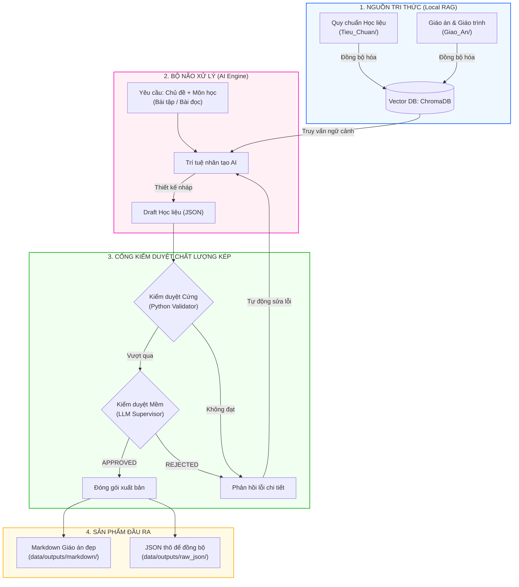

# Hệ thống Hỗ Trợ Đào Tạo Rikkei

Hệ thống ứng dụng kỹ thuật RAG (Retrieval-Augmented Generation) với ChromaDB cục bộ kết hợp bộ não Gemma2 chạy thông qua Ollama để tự động thiết kế và đóng gói học liệu chuyên nghiệp cho học viên theo đúng tiêu chuẩn nghiệp vụ của Rikkei Academy. 

Hệ thống hỗ trợ song hành hai chức năng cốt lõi:
1. **Thiết kế Hệ thống bài tập về nhà (Homework):** Bộ 5 bài phân cấp độ, bối cảnh thực tế đồng nhất, cài bẫy dữ liệu và cấm chỉ định thuật toán (Đóng HOW).
2. **Biên soạn Bài đọc chuyên môn (Reading):** Áp dụng nguyên lý Storytelling in Tech, cấu trúc 7 phần lớn bằng số La Mã (I-VII) với tiêu đề tùy chọn cuốn hút.

---

## Các tính năng nổi bật

1. **Tự động hóa toàn diện (Automated Pipeline):**
   Khi chạy chương trình, hệ thống tự động đồng bộ hóa tài liệu tri thức (RAG), tự động nhận diện ý định của người dùng từ dòng lệnh (Bài tập vs Bài đọc) và kích hoạt AI để thiết kế, kiểm duyệt và xuất bản học liệu mà không cần thông qua menu lựa chọn phức tạp.

2. **Kiểm duyệt kép (Hybrid Validation & Reflection Loop):**
   * **Kiểm duyệt cứng (Programmatic Validation):** Quét cấu trúc dữ liệu JSON bằng mã nguồn Python. Phát hiện thiếu phần, sai mức điểm, thiếu code lỗi bài cơ bản, thiếu so sánh đa giải pháp bài phân tích, thiếu kiến trúc bài sáng tạo đối với Bài tập; hoặc thiếu các phần La Mã, thiếu ví dụ mã nguồn, sai định dạng 3 mức độ câu hỏi đối với Bài đọc; đồng thời chặn đứng quy tắc Đóng HOW.
   * **Kiểm duyệt mềm (LLM Supervisor Evaluation):** LLM Trưởng bộ môn đối chiếu học liệu với tiêu chuẩn nghiệp vụ thực tế để phê duyệt (APPROVED) hoặc từ chối (REJECTED).
   * **Tự động sửa lỗi (Self-Correction):** Nếu bị từ chối, AI sẽ tự động đọc phản hồi chi tiết, tự sửa sai qua các lượt ReAct cho đến khi đạt chuẩn 100%.

3. **Định dạng xuất bản chuẩn hóa:**
   Tự động xuất tệp Markdown không dùng biểu tượng cảm xúc (emoji/icon) ở cả tiêu đề và nội dung, căn lề thẳng tắp khối code mẫu và cấu trúc phân cấp mạch lạc.

---

## Sơ đồ luồng thực thi hệ thống



---

## Quy tắc kiểm duyệt học liệu chi tiết

### 1. Đối với Hệ thống bài tập về nhà (Homework)
Hệ thống áp dụng các quy tắc tự động để đảm bảo cấu trúc bộ 5 bài tập (Tổng điểm = 10):

| Cấp độ bài tập | Tiêu chí yêu cầu | Thao tác kiểm duyệt |
| :--- | :--- | :--- |
| **I. Vận dụng cơ bản** (Bài 1 & 2 - 1.5đ/bài) | Yêu cầu vá lỗi code mẫu. | Bắt buộc có trường `code_loi_chua_sua` chứa mã nguồn lỗi. Yêu cầu các thẻ `[Vấn đề hiện tại]` và `[Yêu cầu đầu ra]`. |
| **II. Vận dụng chuyên sâu** (Bài 3 - 2đ) | Quy tắc nghiệp vụ thực tế. | Yêu cầu học viên nộp 'Báo cáo phân tích và thiết kế giải pháp' trong phần yêu cầu đầu ra. |
| **III. Phân tích** (Bài 4 - 2đ) | Đề xuất đa giải pháp. | Bắt buộc yêu cầu học viên đề xuất tối thiểu 2 phương án khác nhau và lập bảng 'So sánh/Lựa chọn' trade-off. |
| **IV. Sáng tạo** (Bài 5 - 3đ) | Thiết kế kiến trúc module. | Yêu cầu học viên nộp bản 'Thiết kế kiến trúc/luồng dữ liệu' và viết mã nguồn hoàn chỉnh xử lý ngoại lệ. |

### 2. Đối với Bài đọc chuyên môn (Reading)
Áp dụng quy tắc "Storytelling in Tech" và bắt buộc cấu trúc đủ 7 phần La Mã:
*   **I. Đặt vấn đề:** Đưa ra tình huống lỗi thực tế hấp dẫn (Ví dụ: nghẽn cổ chai hệ thống, lỗi logic làm sếp phạt...).
*   **II. Phân tích:** Giải thích tại sao vấn đề xảy ra và tại sao giải pháp thông thường thất bại.
*   **III. Giới thiệu giải pháp:** Đưa ra cú pháp/câu lệnh mới làm cứu cánh.
*   **IV. Ví dụ minh họa:** Khối code mẫu sạch (clean code) có chú thích chi tiết từng dòng.
*   **V. Giải quyết vấn đề:** Áp dụng chính cú pháp mới để viết code fix triệt để lỗi ở phần I.
*   **VI. Tổng kết và lưu ý:** Tóm tắt ngắn gọn và liệt kê các lỗi thường gặp của lập trình viên.
*   **VII. Câu hỏi kiểm tra độ hiểu:** Đúng 3 câu hỏi tự luận ngắn tương ứng 3 cấp độ: Câu 1 (Thông hiểu bản chất), Câu 2 (Vận dụng dự đoán kết quả code), Câu 3 (Phân tích lỗi logic/debug).

---

## Hướng dẫn mở rộng đa môn học

Hệ thống sử dụng cơ chế lọc RAG theo Metadata môn học (subject). Môn học được nhận diện tự động từ tên thư mục chứa tài liệu:
1. Để thêm môn học mới (ví dụ: **Java**), tạo các thư mục:
   * `data/inputs/Tieu_Chuan/Java/`
   * `data/inputs/Giao_An/Java/`
2. Khi khởi chạy:
   ```bash
   python main.py "Bài đọc về cấu trúc rẽ nhánh if-else trong Java"
   ```
   Hệ thống sẽ lọc chính xác bối cảnh RAG với điều kiện `where={"subject": "java"}` để nạp dữ liệu.

---

## Quy chuẩn schema JSON đầu ra

### 1. JSON Bài tập (`RawAgent_[Chủ_Đề].json`)
```json
{
  "subject": "tên môn học viết thường",
  "chu_de": "tên chủ đề học phần",
  "muc_tieu": "mục tiêu buổi học",
  "danh_sach_bai_tap": [
    {
      "ten_bai": "tên bài tập",
      "muc_do": "phân cấp mức độ",
      "boi_canh_nghiep_vu": "bối cảnh thực tế đóng vai",
      "code_loi_chua_sua": "mã nguồn lỗi mẫu hoặc để trống",
      "yeu_cau_chi_tiet": "mô tả kèm các thẻ nghiệp vụ tương ứng"
    }
  ]
}
```

### 2. JSON Bài đọc (`RawAgent_Reading_[Chủ_Đề].json`)
```json
{
  "subject": "tên môn học viết thường",
  "chu_de": "tên chủ đề học phần",
  "dat_van_de_tieu_de": "tiêu đề phần đặt vấn đề",
  "dat_van_de_noi_dung": "nội dung tình huống lỗi thực tế",
  "phan_tich_tieu_de": "tiêu đề phần phân tích nguyên nhân",
  "phan_tich_noi_dung": "nội dung giải thích lý do lỗi",
  "gioi_thieu_giai_phap_tieu_de": "tiêu đề phần cú pháp công nghệ mới",
  "gioi_thieu_giai_phap_noi_dung": "nội dung giải thích lý thuyết giải pháp",
  "vi_du_minh_hoa_tieu_de": "tiêu đề phần code ví dụ",
  "vi_du_minh_hoa_noi_dung": "code mẫu sạch kèm chú thích từng dòng",
  "giai_quyet_van_de_tieu_de": "tiêu đề phần fix lỗi thực tế",
  "giai_quyet_van_de_noi_dung": "mã nguồn/giải thích cách sửa lỗi phần I",
  "tong_ket_luu_y_tieu_de": "tiêu đề phần tổng kết",
  "tong_ket_luu_y_noi_dung": "tóm tắt kiến thức và lỗi thường gặp",
  "bo_cau_hoi_kiem_tra": [
    "Câu hỏi 1 thuộc mức Thông hiểu",
    "Câu hỏi 2 thuộc mức Vận dụng",
    "Câu hỏi 3 thuộc mức Phân tích"
  ]
}
```

---

## Cấu trúc thư mục dự án

```text
AI_Agent/
├── data/                       # Dữ liệu của hệ thống
│   ├── chroma_db/              # Vector Database (ChromaDB) lưu trữ vĩnh viễn
│   ├── inputs/                 # Tri thức đầu vào (Tiêu chuẩn & Giáo án)
│   │   ├── Tieu_Chuan/         # Tài liệu quy định nghiệp vụ bài tập/bài đọc
│   │   └── Giao_An/            # Giáo trình chuyên môn để tham khảo
│   └── outputs/                # Học liệu đã được phê duyệt & đóng gói
│       ├── raw_json/           # File JSON thô do Agent sinh
│       └── markdown/           # File Markdown giao án thành phẩm
│
├── src/                        # Mã nguồn dự án
│   ├── agents/                 # Thiết kế Agent (Base agent & Rikkei Agent)
│   ├── database/               # Kết nối và đồng bộ hóa ChromaDB Vector DB
│   ├── services/               # Kết nối Rikkei Portal API
│   ├── utils/                  # Xuất bản, convert Markdown
│   └── config.py               # Thiết lập cấu hình chung (Folder paths, Model name)
│
├── main.py                     # Entry point chạy tự động của hệ thống
├── requirements.txt            # Danh sách các thư viện phụ thuộc
└── README.md                   # Tài liệu hướng dẫn sử dụng này
```

---

## Hướng dẫn cài đặt và vận hành

### 1. Tải mã nguồn về máy mới (Clone)
Mở cửa sổ terminal và tải dự án về máy:
```bash
git clone https://github.com/quochai0110/AI_AGENT.git
cd 
```

### 2. Thiết lập môi trường ảo (Virtual Environment)
*   **Trên Windows:**
    ```bash
    python -m venv venv
    .\venv\Scripts\activate
    ```
*   **Trên macOS / Linux:**
    ```bash
    python3 -m venv venv
    source venv/bin/activate
    ```

### 3. Cài đặt các thư viện phụ thuộc
Đảm bảo bạn đang ở trong môi trường ảo đã được kích hoạt, tiến hành chạy lệnh:
```bash
pip install -r requirements.txt
```

### 4. Khởi động bộ não AI Local (Ollama)
Tải và cài đặt Ollama từ [ollama.com](https://ollama.com), sau đó khởi động model `gemma2`:
```bash
ollama run gemma2
```

### 5. Chuẩn bị tài liệu tri thức (RAG Inputs)
* Lưu các file tiêu chuẩn thiết kế vào: `data/inputs/Tieu_Chuan/` (Ví dụ: `data/inputs/Tieu_Chuan/Python/tieuchuan_bai_tap.txt`)
* Lưu các file giáo án lý thuyết vào: `data/inputs/Giao_An/` (Ví dụ: `data/inputs/Giao_An/Python/giao_trinh_string.txt`)

### 6. Chạy hệ thống tự động hóa

#### Chế độ 1: Soạn Hệ thống bài tập về nhà (Homework)
Truyền tên chủ đề chứa từ khóa bài tập hoặc mặc định qua dòng lệnh:
```bash
python -X utf8 main.py "Bài tập String trong Python"
```
Hệ thống sẽ chạy pipeline sinh bộ 5 bài tập chuẩn chỉnh, tự sửa sai và xuất bản tệp Markdown sạch bóng emoji.

#### Chế độ 2: Biên soạn Bài đọc chuyên môn (Reading)
Truyền tên chủ đề chứa từ khóa "bài đọc" hoặc "reading" qua dòng lệnh:
```bash
python -X utf8 main.py "Bài đọc về cấu trúc rẽ nhánh if-else trong python"
```
Hệ thống sẽ nhận diện ý định, sinh bài đọc Storytelling cấu trúc La Mã I-VII và xuất bản tệp Markdown sạch bóng emoji.
